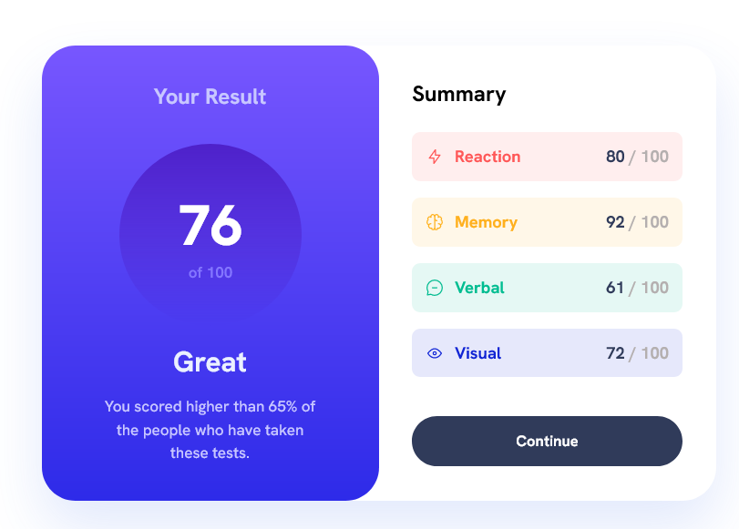
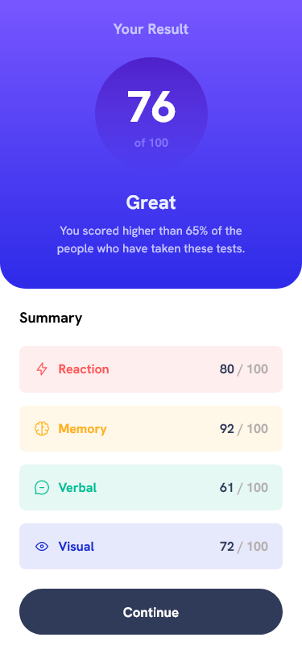

# Frontend Mentor - Results summary component solution

This is a solution to the [Results summary component challenge on Frontend Mentor](https://www.frontendmentor.io/challenges/results-summary-component-CE_K6s0maV). Frontend Mentor challenges help you improve your coding skills by building realistic projects.

## Overview

### The challenge

Users should be able to:

- View the optimal layout for the interface depending on their device's screen size
- See hover and focus states for all interactive elements on the page

### Screenshot

##### Desktop View

##### Mobile View

### Links

- Solution URL: https://www.frontendmentor.io/solutions/results-summary-component-main-solution-65Fv391227
- Live Site URL: https://beamish-brigadeiros-9b6511.netlify.app/

### Built with

- Semantic HTML5 markup
- CSS custom properties
- Flexbox
- CSS Grid
- Mobile-first workflow

## Author

- Website - [My Personal Portfolio](https://daryllosis.me/)
- Frontend Mentor - [@dirtyhoops](https://www.frontendmentor.io/profile/dirtyhoops)
